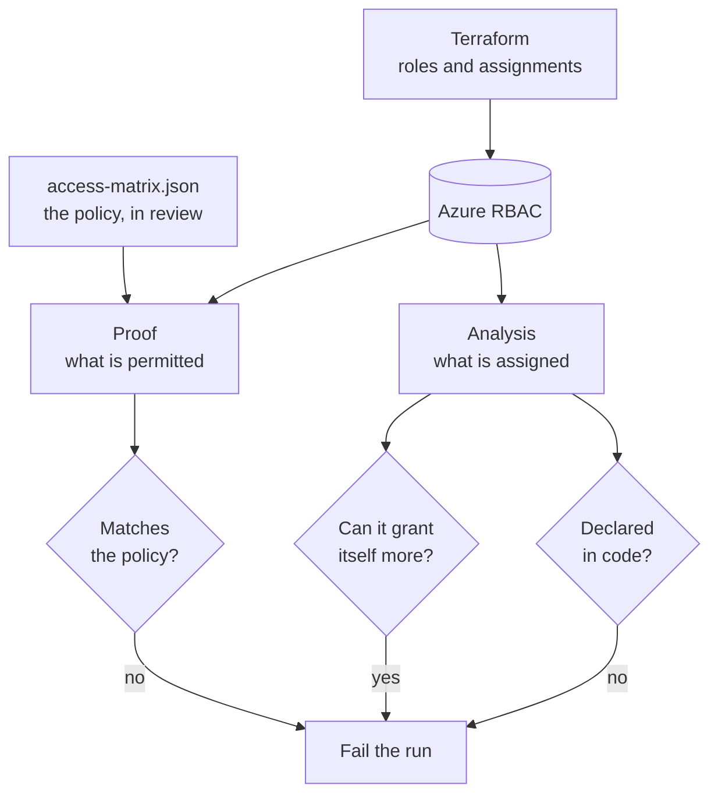

# Least privilege, proven

RBAC defined in Terraform, and then **actually tested**: each identity signs in and attempts the things it should not be able to do, and the pipeline fails if any of them succeed.

Granting a role is easy. Knowing what that role permits is not, and the gap between the two is where incidents come from. A role assignment tells you what Azure was *asked* to allow. This tells you what it *does* allow — which is not always the same thing, and is never the same thing after somebody edits a role in the portal.



## The distinction this lab is built on

Reading role assignments is **analysis**. Signing in and being refused is **proof**. Most RBAC tooling stops at the first, which is why a subtly over-broad custom role survives review: the assignment looks right.

Three identities exist here, each to be told no about something specific:

| Identity | Holds | Must not be able to |
|---|---|---|
| `reader` | Reader | List storage keys, write a tag, assign a role |
| `operator` | A custom *Restart Only* role | List storage keys, write a tag, assign a role |
| `deployer` | Contributor | **Assign a role** |

The last row is the one that matters. Contributor is widely treated as safe precisely because it cannot grant access — and that belief is load-bearing across a lot of estates. Here it is an assertion that runs on every proof.

## What gets checked

| Check | What it catches |
|---|---|
| **Access proof** | An identity permitted something the policy forbids. Fifteen probes, seven of them asserted denials. |
| **The other direction** | An identity refused something it needs. That failure normally gets "fixed" by widening the role, so it is reported as loudly as a hole. |
| **Drift** | A role granted in the portal that source control never declared, and a declared assignment that never landed. |
| **Escalation paths** | Any assignment carrying `roleAssignments/write` without an ABAC condition. The condition is the difference between delegation and self-promotion. |
| **Secret readers** | Anything able to reach a secret *value* rather than a secret *name*. |

## Two mistakes this tooling is built to avoid

**Flagging Contributor.** Contributor is `*` minus the authorization actions. An escalation check that tests for the *pattern* `*/write` flags it, because `NotActions` can block a concrete action but not a wildcard string. A scanner that reports Contributor on every subscription is one nobody reads, so the escalation list holds only concrete actions. Owner is still caught, because `*` matches every one of them.

**Flagging every Reader.** `Microsoft.KeyVault/vaults/secrets/read` is a management-plane action that lists secret *names*, and Reader holds it legitimately. The action that returns a secret *value* is `getSecret`. Conflating them makes every Reader a finding and buries the real ones.

Both are tested, because both are the sort of thing that gets "fixed" back in later.

## Probe credentials

The proof needs to sign in as each identity, which needs a credential. So:

- Each secret is minted at the start of that identity's probes and deleted in a `finally` block, whether or not the probes passed.
- Nothing is stored — no GitHub secret, no Terraform state, no file that outlives the run.
- A separate step after the proof **fails the build** if any probe credential survived.
- The deploy identity can mint them because bootstrap made it an *owner* of those three applications, not because it holds `Application.ReadWrite.All`. In a lab about least privilege, the lab's own identity should not be the exception.

## Repository layout

```
access-matrix.json    The policy: what each identity may and may not do, and why
module/LeastPrivilege/  Escalation, drift and expectation logic. Calls no Azure.
scripts/
  Invoke-AccessProof.ps1    Signs in as each identity and attempts the probes
  Invoke-RbacAnalysis.ps1   Reads live access; reports drift, escalation, secrets
tests/                30 Pester tests, no subscription required
infra/                Custom role, assignments, a target to be refused against
bootstrap/            State, federated identity, the three identities under test
.github/workflows/    CI, Prove (manual), Destroy (manual + nightly)
```

## How to run it

**Prerequisites:** Terraform 1.9+, Azure CLI, PowerShell 7, an Azure subscription where you are Owner, directory rights to create applications, and a fork of this repository.

```powershell
Invoke-Pester ./tests    # 30 tests, no Azure needed
```

1. **Bootstrap** once, after creating the repository so its IDs exist.
2. **Configure GitHub.** An environment named `lab`, and the repository variables from the bootstrap outputs. None are secrets.
3. **Prove.** Run the **Prove** workflow. It defaults to plan-only; set `apply` to provision and run the proof.
4. **Tear down.** Run **Destroy**, or let the nightly schedule do it.

## Cost

| Resource | Rate | Lab cost |
|---|---|---|
| Entra applications, service principals | free | $0 |
| Role assignments, custom role definition | free | $0 |
| One storage account as a probe target | $0.115 per GB-month, holding nothing | fractions of a cent |

This is the cheapest lab in the series. Identity is free; the only billable thing is a storage account that exists to have `listKeys` refused against it.

## Design decisions

- **The matrix is a file, not a script.** Who may do what belongs in review. A change to `access-matrix.json` is a change to the security posture and shows up in a diff as one.
- **Every probe states a reason.** CI fails if one does not, and fails if the matrix asserts no denials, and fails if any identity is never denied anything. A policy where everyone is allowed everything would otherwise pass happily.
- **The custom role declares `not_actions` it does not need.** Its `actions` are narrow enough that `listKeys` and `roleAssignments/write` are not granted anyway. They are written down so a later edit widening the actions cannot silently pick them up.
- **Inherited assignments are excluded from drift.** They are visible at the scope but not the scope's to manage. Including them would report the subscription owner as drift on every run, which is how a drift report gets ignored.

### Things that only surface against real systems

- Role assignments are not enforced the instant they are written. Probing too early reports a denial that is really a timing artefact — the worst possible result for a tool whose whole job is distinguishing allowed from denied. The pipeline waits for the assignments to appear and then waits again.
- A freshly minted service principal secret is not always usable on the first attempt, so sign-in retries rather than failing.
- PSScriptAnalyzer 1.25.0 intermittently throws a `NullReferenceException` part way through a recursive scan. It is non-terminating, so without `-ErrorAction Stop` the run continues and reports zero findings from a scan that never completed. A crashed analyzer must fail the build, not pass it.

## Part of a series

More at [ziyaduqdah.com](https://ziyaduqdah.com/#labs).